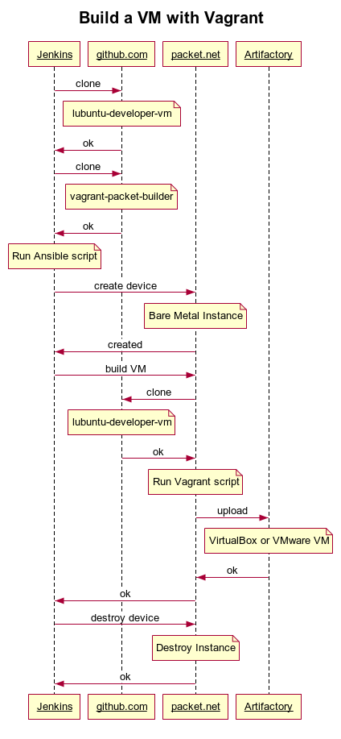

# Creating a virtual machine (VM)
This section describes how to create a virtual machine (VM) using a [Vagrant](https://www.vagrantup.com/) configuration. The VM will be built at [packet.net](https://www.packet.net/), a baremetal cloud provider. Finally the new VM image is uploaded to a file storage like [Artifactory](https://jfrog.com/artifactory/).

## Prerequisites
See [README.md](README.md) for general prerequisites.

### VirtualBox VM
There is no special setup for creating a VirtualBox virtual machine.

### VMWare Workstation VM
Unfortunately you have to pay for some ingredients that are necessary to create a VMware virtual machine:
* Buy a [VMware Workstation 14 Pro](https://store.vmware.com/store?Action=DisplayProductDetailsPage&Locale=en_US&SiteID=vmware&ThemeID=2485600&productID=5124968900) license and provide the key file at a some URL
* Make a VMware-Workstation installation bundle for Linux available at some URL 
* Buy a [Vagrant VMware Provider](https://www.vagrantup.com/vmware#buy-now) license and provide the key file at some URL 

## Create your Vagrant script 
The first step is to create a Vagrant configuration and provide it via a Git repository. Take a look at the [Vagrant Documentation](https://www.vagrantup.com/docs/index.html) on how to do this.

A full example can be found here: https://github.com/fuinorg/lubuntu-developer-vm

## Runing the script
1. Build a VM for VMware Workstation and VirtualBox
   ```
   ansible-playbook playbook-create-vm.yaml 
   --extra-vars 
     '{  
       "git_project_url":"https://github.com/fuinorg/lubuntu-developer-vm.git",
       "git_project_key":"None",
       "packet_project_name":"lubuntu-developer-vm",
       "packet_project_id":"12345678-1234-1234-1234-123456789abc",
       "packet_plan":"baremetal_0",
       "packet_facility":"ams1",
       "packet_operating_system":"ubuntu_17_10",
       "packet_hostname":"lubuntu-developer-vm",
       "packet_api_token":"xxxxxxxxxxxxxxxxxxxxxxxxxxxxxxxx",
       "packet_key_file":"./.ssh/id_rsa.pub",
       "ansible_ssh_private_key_file":"./.ssh/id_rsa",
       "vmware_serialNumber":"XXXXX-XXXXX-XXXXX-XXXXX-XXXXX",
       "vmware_url":"https://files.yourcompany-domain-xyz.com/VMware-Workstation-14-Pro-Linux.bundle",
       "vagrant_vmware_lic_url":"https://files.yourcompany-domain-xyz.com/vmware-workstation.lic",
       "vm_name_vmw":"lubuntu_dev_vmw",
       "vm_name_vbx":lubuntu_dev_vbx",
       "vm_upload_url":"https://yourcompany.jfrog.io/yourcompany/files/",
       "vm_upload_user":"your-user",
       "vm_upload_pw":"xxxxxxx",
       "artifact_version": "1.0.0"
    }'
   ```
2. Building only a VM for VirtualBox
   ```
   ansible-playbook playbook-create-vm.yaml
   --skip-tags vm_vmware 
   --extra-vars 
     '{ 
       "git_project_url":"https://github.com/fuinorg/lubuntu-developer-vm.git",
       "git_project_key":"None",
       "packet_project_name":"lubuntu-developer-vm",
       "packet_project_id":"12345678-1234-1234-1234-123456789abc",
       "packet_plan":"baremetal_0",
       "packet_facility":"ams1",
       "packet_operating_system":"ubuntu_17_10",
       "packet_hostname":"lubuntu-developer-vm",
       "packet_api_token":"xxxxxxxxxxxxxxxxxxxxxxxxxxxxxxxx",
       "packet_key_file":"./.ssh/id_rsa.pub",
       "ansible_ssh_private_key_file":"./.ssh/id_rsa",
       "vm_name_vbx":lubuntu_dev_vbx",
       "vm_upload_url":"https://yourcompany.jfrog.io/yourcompany/files/",
       "vm_upload_user":"your-user",
       "vm_upload_pw":"xxxxxxx",
       "artifact_version": "1.0.0"
     }'
   ```
3. Building only a base image for VMware Workstation
   ```
   ansible-playbook playbook-create-vm.yaml
   --skip-tags vm_virtualbox 
   --extra-vars 
     '{ 
       "git_project_url":"https://github.com/fuinorg/lubuntu-developer-vm.git",
       "git_project_key":"None",
       "packet_project_name":"lubuntu-developer-vm",
       "packet_project_id":"12345678-1234-1234-1234-123456789abc",
       "packet_plan":"baremetal_0",
       "packet_facility":"ams1",
       "packet_operating_system":"ubuntu_17_10",
       "packet_hostname":"lubuntu-developer-vm",
       "packet_api_token":"xxxxxxxxxxxxxxxxxxxxxxxxxxxxxxxx",
       "packet_key_file":"./.ssh/id_rsa.pub",
       "ansible_ssh_private_key_file":"./.ssh/id_rsa",
       "vmware_serialNumber":"XXXXX-XXXXX-XXXXX-XXXXX-XXXXX",
       "vmware_url":"https://files.yourcompany-domain-xyz.com/VMware-Workstation-14-Pro-Linux.bundle",
       "vagrant_vmware_lic_url":"https://files.yourcompany-domain-xyz.com/vmware-workstation.lic",
       "vm_name_vmw":"lubuntu_dev_vmw",
       "vm_upload_url":"https://yourcompany.jfrog.io/yourcompany/files/",
       "vm_upload_user":"your-user",
       "vm_upload_pw":"xxxxxxx",
       "artifact_version": "1.0.0"
     }'
   ```

## Debugging on the server
You can also add `--skip-tags delete` to keep the server instance running after some kind of failure. This allows debugging something directly on the packet.net server instance.

## General hint
Be aware that above commands must be on a single command line to execute. Here they are only formatted nicely for better reading.

# Architecture
Here is a brief overview of how this Ansible script actually works.

This example assumes: 
* Jenkins is used to run this Ansible script (See [Jenkinsfile](https://github.com/fuinorg/lubuntu-developer-vm/blob/master/Jenkinsfile) for details)
* A VirtualBox or VMware virtual machine (VM) is created using project [lubuntu-developer-vm](https://github.com/fuinorg/lubuntu-developer-vm)
* Artifactory is used to store the created virtual machines (VMs)



(Source: [build-sequence-vm.txt](build-sequence-vm.txt) used at https://www.websequencediagrams.com)

